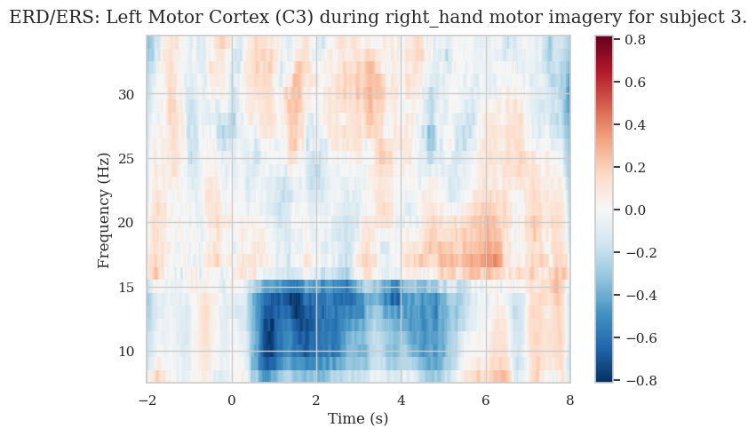
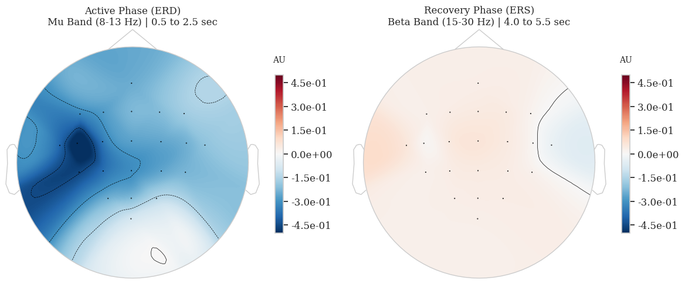
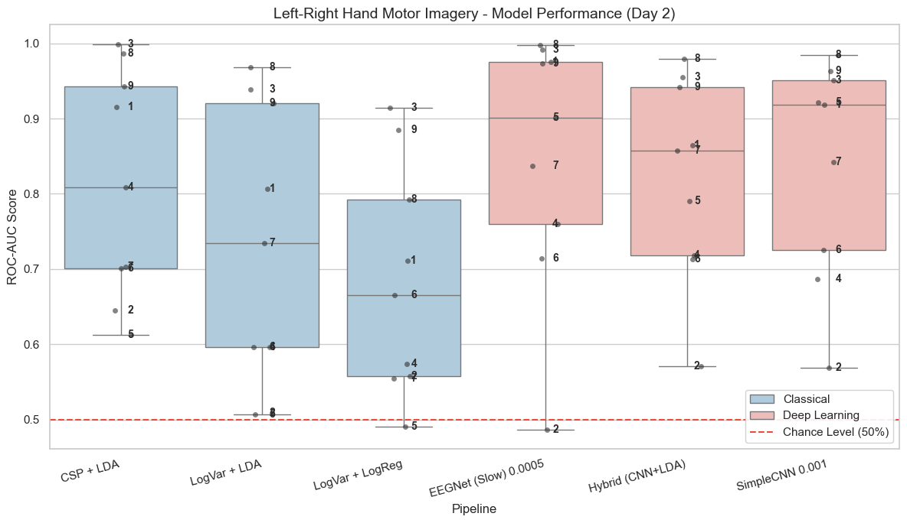
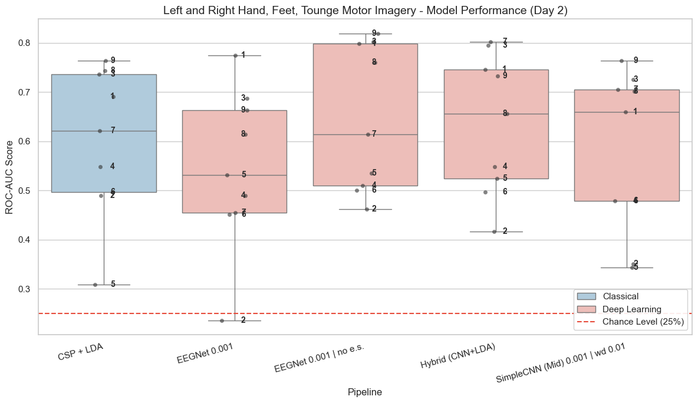
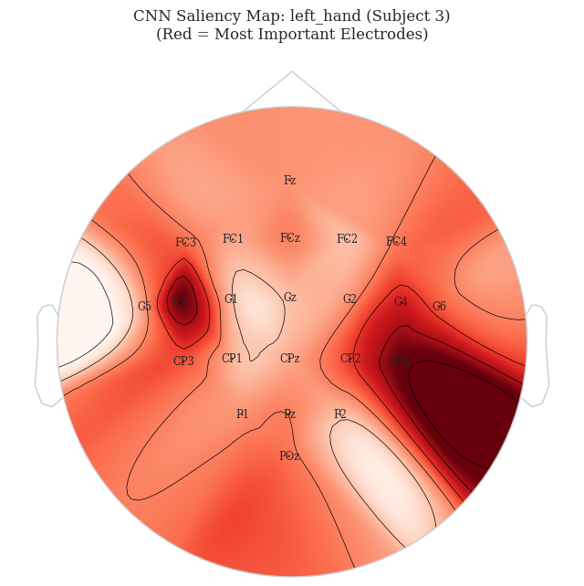
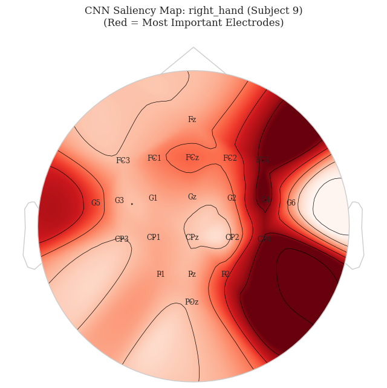
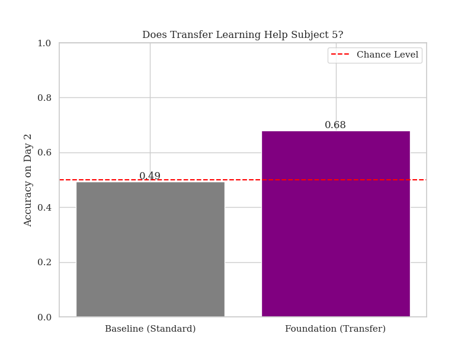

# Brain Computer Interface (BCI): Deep Learning vs. Classical ML for Motor Imagery

**Biological Data Science, Final Project**

## What Is This?

This project decodes Motor Imagery (MI) from raw EEG data. The idea is simple: when you *imagine* moving your left hand, your brain produces a measurable pattern over the right motor cortex (and vice versa). This is called Event-Related Desynchronization (ERD), and it's the core mechanism behind Brain-Computer Interfaces.

The question I wanted to answer: can modern deep learning architectures actually beat the classical BCI pipelines that have been around for decades? And more importantly, can *any* of these models generalize across different recording sessions, where the EEG signal is notoriously non-stationary?

All evaluations use a **Cross-Session** design: train on Day 1, test on Day 2. No peeking.

## The Dataset

I used the [BCI Competition IV 2a](http://www.bbci.de/competition/iv/) dataset (BNCI2014-001), accessed through [MOABB](https://moabb.neurotechx.com/docs/index.html). Here's what it looks like:

| Property          | Value                                    |
| ----------------- | ---------------------------------------- |
| Subjects          | 9                                        |
| Electrodes        | 22 (10-20 system)                        |
| Sampling Rate     | 250 Hz                                   |
| Sessions          | 2 per subject (Day 1 / Day 2)            |
| Classes (Binary)  | Left Hand, Right Hand                    |
| Classes (4-Class) | Left Hand, Right Hand, Both Feet, Tongue |
| Paradigm          | Motor Imagery                            |
| Bandpass          | ~ 4-40 Hz                                  |

The cross-session setup is what makes this dataset interesting and difficult. EEG recordings shift between days due to cap repositioning, impedance changes, and just general neural variability. A model that overfits on Day 1 will just completely fail on Day 2.

## The Biological Foundation

Before throwing any machine learning at this data, it's worth understanding *what* the models are actually trying to learn. This is where the neuroscience comes in.

### Event-Related Desynchronization (ERD)

When you imagine moving your right hand, the mu rhythm (8-13 Hz) power *decreases* over the left motor cortex (electrode C3). This power drop is the ERD, and it's the signal we're trying to classify.

Here's what that looks like in a time-frequency plot for Subject 3 during right-hand imagery:

<p align="center">
  
</p>

The blue region in the 8-15 Hz band during the 0-4 second window is the ERD. After the imagery period ends (around 4 seconds), you can see a "rebound" in the beta band (15-30 Hz), known as Event-Related Synchronization (ERS). This is the brain's motor cortex returning to its resting state.

### Topographic Maps

The topomap view shows the spatial distribution of the ERD across the scalp. For right-hand imagery, we expect the strongest desynchronization over the left motor cortex (around C3). Here's Subject 3:

<p align="center">
  
</p>

The left panel shows the active phase (ERD in the mu band, 0.5-2.5s). You can clearly see the strong desynchronization over the left hemisphere, exactly where the contralateral motor cortex is. The right panel shows the recovery phase (beta band, 4.0-5.5s). Interestingly, the beta rebound (ERS) is barely visible here. This is actually common in motor imagery paradigms, as the beta rebound tends to be much fainter and less reliable than in actual motor execution.

These plots aren't just pretty pictures. They confirm that the underlying biology is real and that there are learnable patterns in the data. If you don't see ERD, no classifier will save you.

## Models and Pipelines

### Classical Baselines
- **CSP + LDA**: Common Spatial Patterns for feature extraction, Linear Discriminant Analysis for classification. The gold standard in BCI research.
- **LogVariance + LDA**: Log-variance of each channel as features, classified by LDA.
- **LogVariance + LogReg**: Same features, Logistic Regression classifier.

### Deep Learning
- **SimpleCNN**: A custom two-block CNN with temporal and spatial convolutions. 42,948 parameters.
- **EEGNetv4**: The compact CNN architecture from Lawhern et al. (2018), using depthwise and separable convolutions. Only 1,524 parameters. The last layer is modified to use Global Average Pooling for better generalization.
- **Hybrid (CNN+LDA)**: SimpleCNN as a feature extractor, feeding into LDA. Combines deep feature learning with a linear classifier.

The parameter count difference between SimpleCNN (42,948) and EEGNet (1,524) is significant. EEGNet was specifically designed to be parameter-efficient for EEG, where you typically have very limited training data.

### Key Architecture: EEGNetv4

```python
class EEGNetv4(nn.Module):
    """
    Famous compact CNN for EEG (Lawhern et al., 2018).
    Uses Depthwise and Separable Convolutions to reduce parameters while retaining performance.
    Important Disclosure: The last layer is modified to Global Average Pooling as it fits
    better for our specific use-case and reduces overfitting.
    """
    def __init__(self, n_channels, n_classes, n_times, dropoutRate=0.5, kernLength=64, F1=8, D=2, F2=16):
        super(EEGNetv4, self).__init__()
        # Block 1: Temporal Conv -> Depthwise Spatial Conv
        self.conv1 = nn.Conv2d(1, F1, (1, kernLength), padding=(0, kernLength // 2), bias=False)
        self.bn1 = nn.BatchNorm2d(F1)
        # Depthwise: Learns spatial filters for each temporal filter separately
        self.conv2 = nn.Conv2d(F1, F1 * D, (n_channels, 1), groups=F1, bias=False)
        self.bn2 = nn.BatchNorm2d(F1 * D)
        self.elu = nn.ELU()
        self.avgpool1 = nn.AvgPool2d((1, 4))
        self.dropout1 = nn.Dropout(dropoutRate)
        # Block 2: Separable Conv (Pointwise -> Depthwise)
        self.conv3 = nn.Conv2d(F1 * D, F1 * D, (1, 16), padding=(0, 8), groups=F1 * D, bias=False)
        self.conv4 = nn.Conv2d(F1 * D, F2, (1, 1), bias=False)
        self.bn3 = nn.BatchNorm2d(F2)
        self.avgpool2 = nn.AvgPool2d((1, 8))
        self.dropout2 = nn.Dropout(dropoutRate)
        # Global Average Pooling classifier (size-invariant)
        self.classifier = nn.Sequential(
            nn.AdaptiveAvgPool2d((1, 1)),
            nn.Flatten(),
            nn.Linear(F2, n_classes)
        )
```

### MOABB Integration

All models (including the PyTorch ones) are wrapped in a custom `CNNEstimator` class that implements scikit-learn's `BaseEstimator`, `ClassifierMixin`, and `TransformerMixin` interfaces. This lets them plug directly into MOABB's `CrossSessionEvaluation` pipeline, which handles all the data loading, splitting, and scoring automatically.

The wrapper handles:
- Channel-wise standardization (instead of the older global scaling approach)
- Automatic label encoding for string class labels
- Kaiming He weight initialization
- Early stopping with validation split
- LR scheduling via `ReduceLROnPlateau`
- MaxNorm constraints for EEGNet (per the original paper)
- GPU memory monitoring every 10 epochs

## Task 1: Binary Classification (Left vs. Right)

**Classes:** Left Hand (ERD over right motor cortex, C4) vs. Right Hand (ERD over left motor cortex, C3)

**Evaluation:** Cross-Session, ROC-AUC, Chance = 0.50

<p align="center">
  
</p>

Each dot is a subject (labeled by number). The numbers next to each dot let you track individual subjects across pipelines.

**Key observations:**
- CSP+LDA is a strong baseline. It's hard to beat with deep learning here, but!
- The deep learning models (pink boxes), indeed, generally have higher medians and win the best performance award as well. Subject 9 had a 100% accuracy!
- Subject 2 and Subject 5 consistently perform near or at chance across all models. This is a real phenomenon called "BCI Illiteracy" and no amount of model tuning fixes it (their ERD patterns are just too weak or inconsistent).
- Subject 3 and Subject 8 are also stars of the show. Their ERD signals are clean and lateralized, and every model picks them up easily.

> **Thoughts:** Initially, it was very difficult to get the deep learning models to surpass CSP+LDA. I implemented a lot of standardization/normalization tweaks to get them working reliably. During testing, I had a constant feeling of *randomness*. Some participants performed very well consistently, but others went from 0.75 to 0.50 ROC-AUC across training sessions. Setting a random seed, hyperparameter tuning, implementing weight decay, and letting go of early stopping was the best combination I found for the most robust results. However, the specifications are different for each model. Overall, optimized deep learning models offer an edge over simple linear models in this task.

## Task 2: Four-Class Classification

**Classes:** Left Hand, Right Hand, Both Feet (midline activation, Cz), Tongue (bilateral patterns)

**Evaluation:** Cross-Session, Accuracy, Chance = 0.25

<p align="center">
  
</p>

The 4-class problem is significantly harder. Chance level drops to 25%, but the gap between good and bad subjects widens dramatically. EEGNet (only without early stopping!), the Hybrid model and my SimpleCNN model show more consistent performance above CSP+LDA in this setting, suggesting deep learning has more to offer when the classification problem is more complex. But to give credit, CSP+LDA did amazing, and it was much quicker too...

## Model Validation: CNN Saliency Maps

An important question: *is the CNN actually learning the right thing?* Saliency maps show which electrodes and locations the model considers most important for its predictions.

<p align="center">
  
  
</p>

**Left:** Subject 3, left-hand imagery. The hotspots are concentrated over motor cortex areas (C3, CP3, C4, P4).

**Right:** Subject 9, right-hand imagery. Peak importance at C4, FC4, CP4.

An important caveat: saliency maps show what the *model* considers important for its classification decision. This is not the same as showing the biology directly. The model might place high importance on an electrode because of a strong ERD there, but it could also flag a region because of the *absence* of activity, or some other statistical pattern it found useful for separating the classes. So while it's encouraging that the CNN focuses on motor cortex regions rather than, say, frontal electrodes (which would suggest it's learning eye movement noise), we should be careful not to interpret saliency as a direct map of neural activity.

## Transfer Learning: Helping Struggling Subjects (*in progress*)
> Note: This is an older analysis and Subject 5's performance increased by just experimenting with hyperparameters. But I kept this in, as it illustrates the point!

Subject 5 was a textbook "BCI Illiterate" case: their binary classification score hovers right around chance (0.49-0.50) across all models. Can transfer learning help?

The idea: pre-train a "foundation" model on data pooled from all 8 other subjects, then fine-tune it on Subject 5's Day 1 data.

<p align="center">
  
</p>

The transfer learning approach pushed Subject 5 from 0.49 (literally chance) to 0.68. It's not amazing, but it shows that there's usable information in cross-subject patterns that can bootstrap a weak individual model. *In hindsight, this may have just been the artifact of increased epochs/different parameters than in previous testing.*

## How to Run

### Requirements
- Python 3.11+
- NVIDIA GPU with CUDA support (recommended for training, not required for analysis)
- ~30-60 minutes for binary classification training, ~60+ minutes for 4-class (on a GTX 1650)

### Setup
```bash
pip install -r requirements.txt

# Only if you have an NVIDIA GPU and want to train models:
pip install torch torchvision --index-url https://download.pytorch.org/whl/cu126
```

### Quick Start
The notebook includes pre-computed result CSVs (`data/left_right_results_confirmed.csv` and `data/4_MI_results_confirmed.csv`). These let you skip the heavy training step, but still be able to plot the accuracy plots and model comparisons.

**However**, the raw BCI dataset itself still needs to be downloaded. The time-frequency analysis, ERD topomaps, saliency maps, and anything that works with the actual EEG signals all require the original data. MOABB handles this automatically on first run, but be aware that the BNCI2014-001 dataset is several hundred MB. It will download to a local MOABB cache directory.

> The dataset is available to download at the first code block!

## Project Structure


```
BCI-Motor-Imagery/
├── README.md
├── requirements.txt
├── .gitignore
├── data/
│   ├── left_right_results_confirmed.csv
│   └── 4_MI_results_confirmed.csv
├── notebooks/
│   └── BCI_MI_Classification.ipynb
├── figures/
│   ├── left_right_performances.png
│   ├── 4motor_performances.png
│   ├── ERD_C3_right_hand_s3.png
│   ├── topoERD_C3_right_hand_s3.png
│   ├── saliency_map_s3_left.png
│   ├── saliency_map_s9_right.png
│   └── foundation_subj5_o.png
├── Accuracy_plots/          # All accuracy comparison figures
├── ERD/                     # ERD time-frequency and topomap plots
├── Saliency_maps/           # CNN saliency map visualizations
├── Stats/                   # Statistical correlation plots
└── Transfer_learning/       # Transfer learning experiment results
```

## One Last Thought: Early Stopping Can Hurt

This came up repeatedly during the project and I think it's worth highlighting. Early stopping is often a good idea in deep learning. You set aside a validation split, monitor the loss, and stop training when it stops improving. Saves time, prevents overfitting. Standard stuff.

But with a dataset this small (144 trials per session), it's a real tradeoff. That 15% validation split means you're training on even fewer trials, and the validation set isn't necessarily representative of the Day 2 test data anyway.

As a concrete example: Subject 5 performed at chance level (~50%) when using early stopping with a 15% validation split. When I disabled early stopping and let the network train on 100% of the Day 1 trials, Subject 5's accuracy jumped to roughly 85% on the Left-Right task. For subjects with weak signals, maximizing training data volume turned out to be more important than preventing theoretical overfitting.

This is also why the 4-class results include one EEGNet variant *with* early stopping and one *without*. The difference is visible in the boxplot.

## References

- Tangermann, M. et al. (2012). Review of the BCI Competition IV. *Frontiers in Neuroscience*.
- Lawhern, V. J. et al. (2018). EEGNet: A compact convolutional neural network for EEG-based brain-computer interfaces. *Journal of Neural Engineering*.
- Pfurtscheller, G. & Lopes da Silva, F. H. (1999). Event-related EEG/MEG synchronization and desynchronization: basic principles. *Clinical Neurophysiology*.
- Wolpaw, J. R. et al. (2002). Brain-computer interfaces for communication and control. *Clinical Neurophysiology*.
